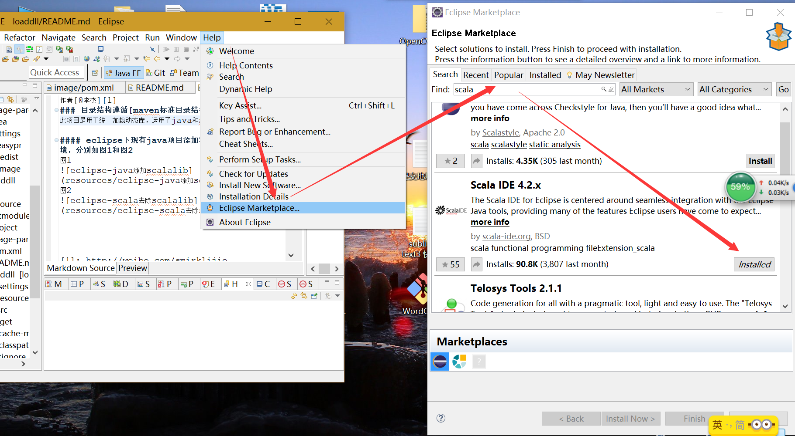
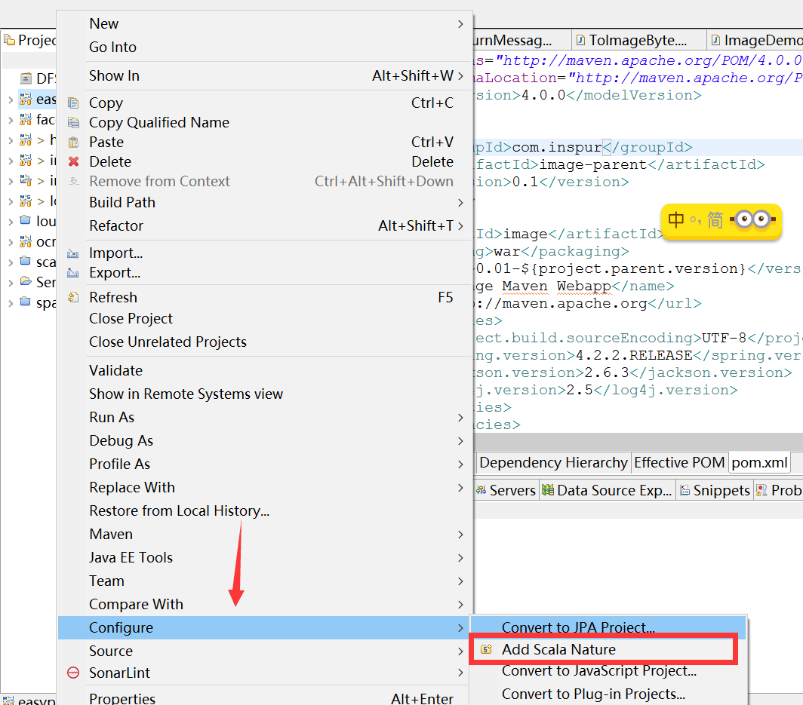
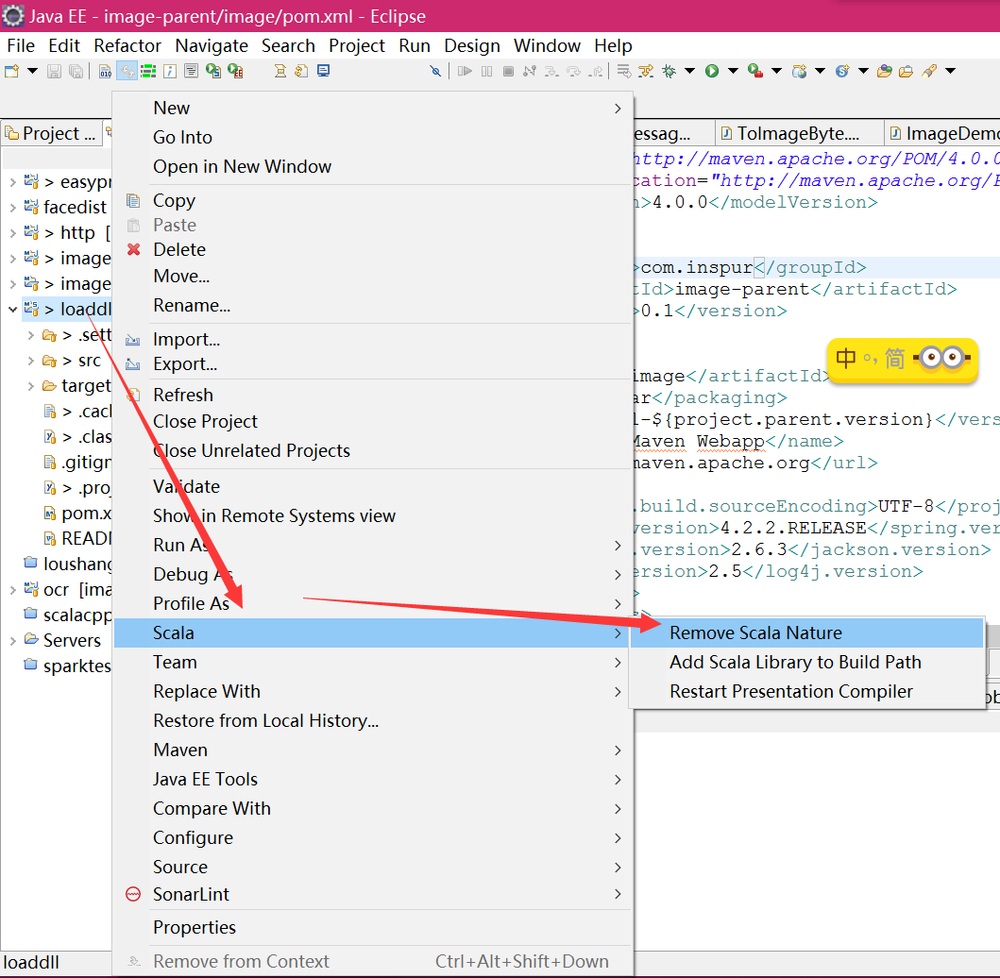
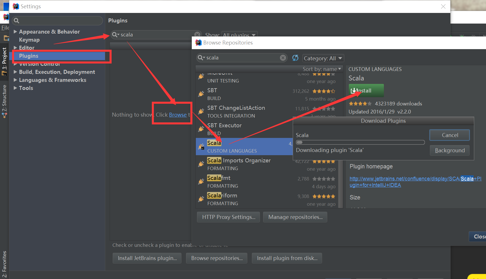
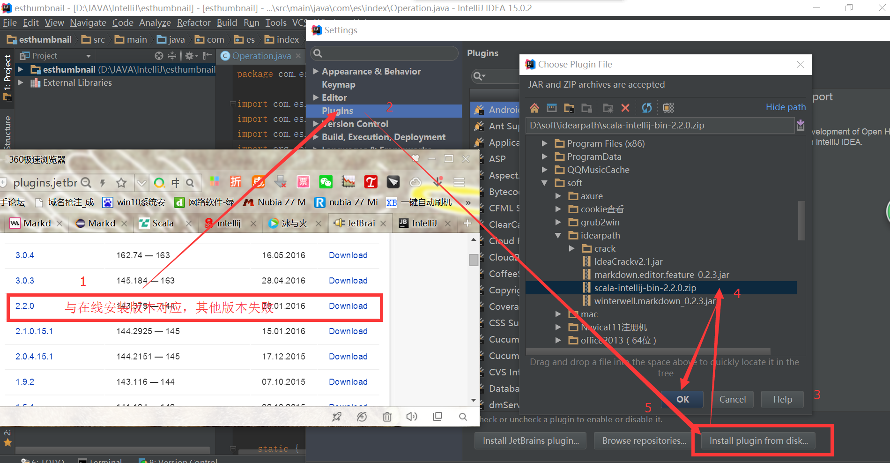
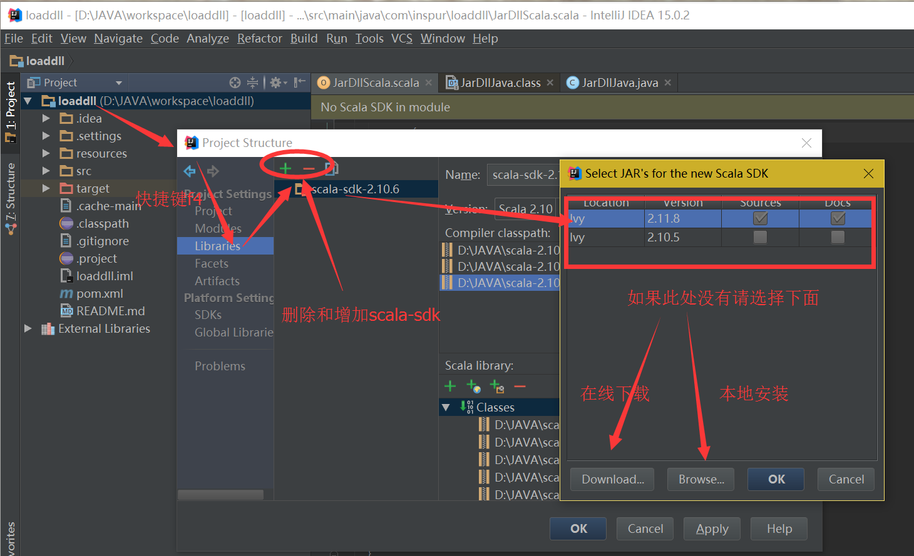

作者[@李杰][1]
### 目录结构遵循[maven标准目录结构][2]
此项目是用于统一加载动态库，运用了java和scala两种方法,jni方法,参考另一个[项目scalacpptest][5],其中文件放置是目录参考项目
[javacpp][6]org.bytedeco.javacpp.Loader.java的getTempDir()函数

### 思考，tempDir应该放在一个类下或者两个类比较统一，这样才不会重复解压动态库，加载不同路径动态库

以pom方式导入后检查是否支持scala环境，不支持，按照下面方式执行

### eclipse(Mars-4.5.1版示例)添加scala插件，以及对现有java项目添加和去除scala编译环境，如下面图示
#### 图1-1 eclispe-scala插件安装

#### 图1-2 eclipse-java添加scalalib

#### 图1-3 eclipse-scala去除scalalib

#### 注:如果安装失败进入[官网][3]查看

### intellij-idea(15.0.2版示例)添加scala插件，以及对现有java项目添加和去除scala编译环境，如下面图示 
#### 图2-1 intellij-idea-scala插件在线安装

#### 注：如果安装失败，请用下面的方法
#### 图2-2 intellij-idea-scala插件离线安装[地址][4]

#### 图2-3 intellij-java添加scalalib

#### 图2-4 intellij-java添加和删除scalalib

[1]: http://weibo.com/smirklijie
[2]: http://maven.apache.org/guides/introduction/introduction-to-the-standard-directory-layout.html
[3]: http://scala-ide.org/
[4]: http://plugins.jetbrains.com/plugin/?idea&id=1347
[5]: https://git.oschina.net/smirkcat/scalacpptest
[6]: https://github.com/bytedeco/javacpp